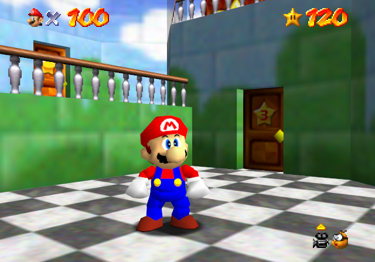

# Freezing the Camera

The method used to freeze the camera in <i>Super Mario 64</i> has been changed throughout the years. There is currently two mainstream ways of freezing the camera - **freeze** and **soft-freeze**.



When the game is *frozen*, Mario can move around freely and even enter first-person mode (shown above). This, however, does not work properly in all levels of the game.

When the game is *soft-frozen*, the camera may become "loose" and wobble around a little, but it works in all levels of the game.

### Memory Functions

##### Freeze

To freeze the camera, a `0x80` byte must be inserted at `0x8033C848`. To unfreeze, insert `0x00`.

When *frozen*, the game believes the camera is paused. Because of this, the camera will zoom out afar in some levels, the same way the pause screen shows an overhead view of the map.

This can be fixed, however. From addresses `0x802879EC` to `0x80287BC3` is the function that zooms out the camera when the game is paused. If the entire function is replaced with zeroes, the camera will no longer zoom out and will remain in place when frozen. This trick was originally discovered by *Llennpie*.

Here is an code example which uses *mupen64plus*'s debugger memory functions.
```cpp
void SetFreezeCamera(bool toggle) {
    int value = (toggle) ? 0x80 : 0x00;
    (*DebugMemWrite8)(0x8033C848, (unsigned char)(value));
}
```

There is a bug that may prevent Mario from exiting C-UP mode once it has been entered while frozen. When Mario exits C-UP, the camera byte changes to `0x22`. However, if Mario exits C-UP while the camera is frozen, it may change the byte to `0xA2` (`0x80` + `0x22`). This will prevent Mario from exiting C-UP mode, and he will be stuck in place until the camera is unfrozen.

##### Soft-Freeze

To soft-freeze the camera, a `0x01` byte must be inserted at `0x8033B205`. To unfreeze, insert `0x33`.

Here is another code example in *mupen64plus*.
```cpp
void SetSoftFreezeCamera(bool toggle) {
    int value = (toggle) ? 0x01 : 0x33;
    (*DebugMemWrite8)(0x8033B205, (unsigned char)(value));
}
```

##### GameShark Code

I have created a GS code capable of freezing/unfreezing the camera.

```
D133AFA0 0800
8033C848 0080
D133AFA0 0400
8033C848 0000
D133AFA2 0200
8033B205 0001
D133AFA2 0100
8033B205 0033
```

The *DPAD-UP*/*DPAD-DOWN* buttons control the freeze camera, while the *DPAD-LEFT*/*DPAD-RIGHT* buttons control the soft-freeze camera.
