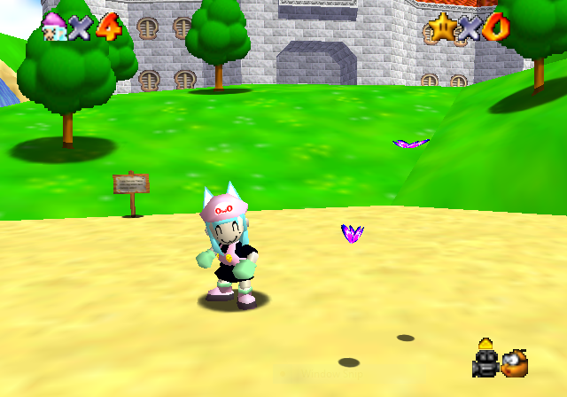

# v64.dev

This documentation has been created to assist developers in creating their own <i>Super Mario 64</i> machinima tools, or modifying [M64MM](https://github.com/projectcomet64/M64MM)'s source code.

Please note that this documentation is unfinished, and will be changing as more features are added.

##### Table of Contents

<ul>
    <li>
        <a href="#/camera">Freezing the Camera</a>
    </li>
</ul>